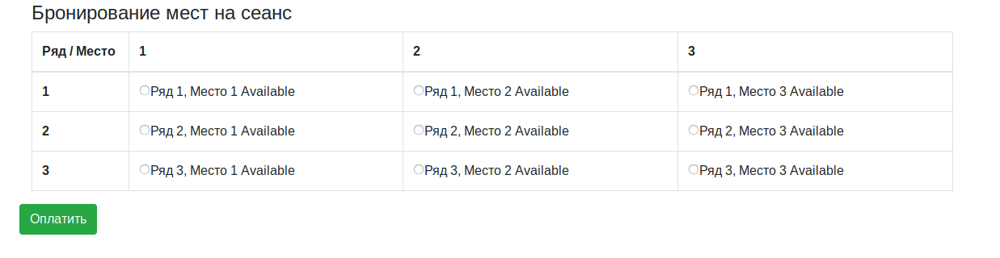
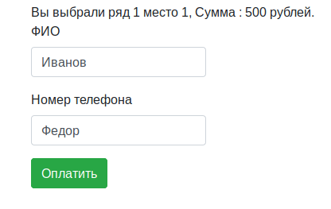
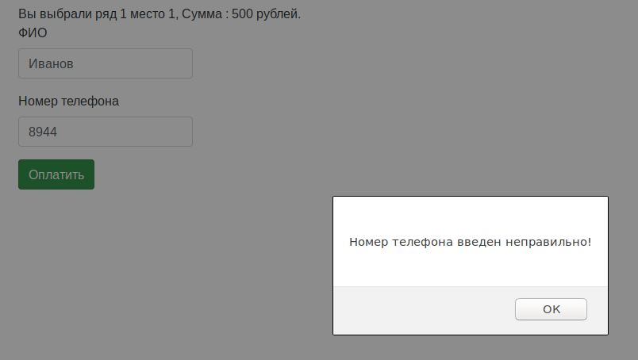
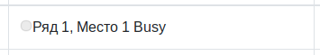

# ticketing-webservice

В данном репозитории находится пример простого веб-приложения по бронированию билетов 
в кинотеатр.

Используется :

    Java
    Servlets
    JDBC + PostgreSQL    
    JSON + Jackson    
    HTML, Bootstrap
    JavaScript, Ajax, JQuery

Возможности приложения :

На стартовой странице пользователю предлагается выбрать место, 
отображаются свободные и занятые места. Занятое место выбрать нельзя.
После выбора места и нажатия кнопки "Оплатить" происходит переход на страницу оплаты,
где отображается стоимость выбранного билета и пользователю предлагается ввести свое имя и 
номер телефона, корректность ввода имени(имя введено) и номера телефона проверяется.
Далее происходит редирект на страницу index.html и данное место меняет статус с Available на Busy.

- Вывод на страницу всех доступных мест и их статусов

- Страница оплаты

- Проверка введенных данных на странице оплаты

- Статус места после оплаты - занято не доступно для дальнейшего выбора

_Установка и запуск :_

1. Загрузить с GitHub zip архив и распаковать его. Или склонировать 
репозиторий.
2. Установить Apache Tomcat и сконфигурировать его. Приложение 
тестировалось и отлаживалось с использованием контейнера Apache Tomcat 9.0.16.
3. Запустить и посмотреть работу приложение можно в IDE Intellij IDEA.
3. Для запуска приложения стартовая страница находится по адресу
http://localhost:8080/index.html , ее необходимо указать в конфигурации 
Apache Tomcat для IDE, или ввести вручную в строку браузера после запуска 
приложения.